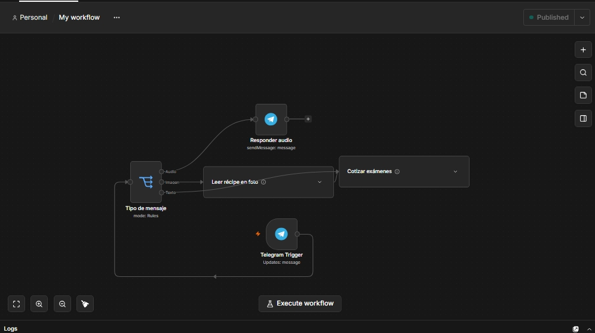
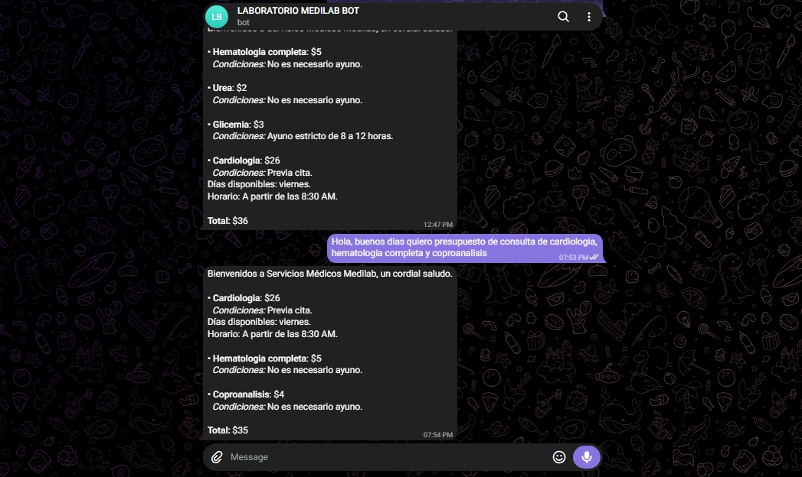

# Bot-de-Cotizaci-n-para-Laboratorio-Cl-nico-n8n-OpenAI-Notion-
Este proyecto es una solución automatizada para laboratorios clínicos que responde consultas de precios y condiciones de exámenes a través de Telegram de forma automática.

## 🚀 ¿Cómo funciona?
1. **Telegram:** El cliente pregunta o envia la imagen de un recipe por un examen (ej. *"precio de hematología y glicemia"*).
2. **OpenAI (IA):** Identifica y extrae los nombres de los exámenes.
3. **Notion API:** Busca los precios y horas de ayuno en la base de datos del laboratorio.
4. **Respuesta:** Le envía al cliente el desglose exacto en un solo mensaje.

## 📷 Demostración del Proyecto

### Flujo en n8n:

### Respuesta en Telegram:

## 🛠️ Tecnologías utilizadas
* **n8n:** Orquestador de la automatización.
* **OpenAI (GPT-4o-mini):** Procesamiento de lenguaje natural.
* **Notion API:** Base de datos de exámenes y precios.
* **Telegram Bot API:** Interfaz de comunicación con el cliente.
